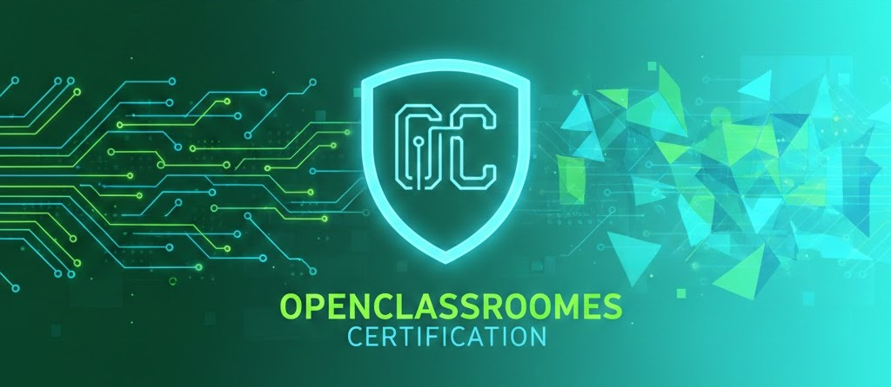

# 🎓 OpenClassrooms Certifications

This repository centralizes all the certifications I have obtained through **OpenClassrooms** as part of my journey toward becoming a professional **web and software developer**.

It serves as a structured and transparent record of my learning path, covering **front-end development, programming fundamentals, tooling, and best practices**.

---

## 📚 Certifications by Skill Area

### 🧠 Programming Fundamentals
- Learn to Program in C
- Learn to Program with JavaScript

### 🎨 Front-End Development
- Build Your Website with HTML5 & CSS3
- Create Responsive Websites with Bootstrap 5
- Simplify CSS with Sass
- Create Modern CSS Animations

### 🧩 UI / UX & Integration
- Create a Web Mockup with Figma
- Integrate a Figma Mockup into HTML & CSS

### ♿ Accessibility & Web Standards
- Design Accessible Web Content
- Understand the Web

### 🛠 Tooling & Development Environment
- Set Up Your Front-End Development Environment
- Learn to Use the Command Line (Terminal)

### 🔄 Version Control & Collaboration
- Manage Code with Git and GitHub
- Become an Expert in Git and GitHub

### 🚀 Industry & Career Awareness
- Discover Developer Careers

---

## 🎯 Purpose of This Repository

- Showcase verified learning achievements
- Demonstrate consistency and commitment to skill development
- Provide recruiters and collaborators with a clear overview of my technical foundations
- Serve as a reference alongside my portfolio and GitHub projects

---

## 🧠 Skills Covered

- Programming fundamentals (C, JavaScript)
- Front-end development (HTML5, CSS3, Bootstrap, Sass)
- UI/UX and prototyping (Figma)
- Accessibility and web standards
- Version control and collaboration (Git, GitHub)
- Command-line usage and development environment setup
- Web ecosystem and developer workflows

---

## 🚀 Next Steps

This repository will be updated regularly as I complete new certifications and expand my skill set, including advanced projects and real-world applications.

---

## 📎 Notes

Each certification is officially issued by **OpenClassrooms** and reflects validated competencies through hands-on projects and assessments.

For concrete implementations of these skills, please refer to my other GitHub repositories and portfolio projects.

---
